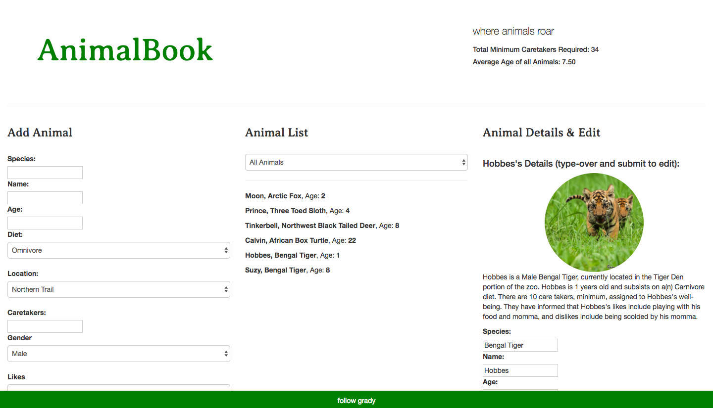

# _AnimalBook_



A zoo manager's best friend. This typescript and angular 2 website can help you track animal data at your local zoo. Zoo staff can add and edit an animal's personal profile. See all animals or group them by age and diet! See the total minimum caretakers required on a day-to-day basis, and checkout the average animal age at the zoo. Using custom components and ng pipes, this site is perfect for organizing a busy zoo manager's day.

### MVP features

* Each animal has properties describing its: species, name, age, diet, location, amount of caretakers, gender, likes, dislikes, and an image url for display.
* Users can add a new animal to the site.
* Users can see a list of all animals by default and filter between available lists of young animals (under two years old), and mature animals (two years and older).
* Users can click an animal to edit its properties.
* Site will list minimum total number of caretakers needed in a day.
* Average age of all animals.
* Group by Diet type (carnivores, omnivores, herbivores).

### Room for additional Functionality

* Group by species- specific data features of subgroups (avg age, total caretakers).
* Featured animal of the day.

### Prerequisites

* Web browser with ES6 compatibility
* Examples: Chrome, Safari

* Ruby 2.3.1 (for SCSS)
* Node Package Manager (npm)
* Bower

### Setup/Installation Requirements

* If you would like to clone this app to your local machine, download this repository at https://github.com/gravytates/animalBook.git
* Open in desktop
* Run:
```
$ npm install
$ bower init
$ bower install bootstrap --save
$ gulp build --production
$ gulp serve
```

### Code Sample


Pipe using transform method to filter animals:
```
transform(input: Animal[], filterCondition){
  var output: Animal[] = [];
  switch(filterCondition){
    case "youngAnimals":
      return input.filter(function(animal){
        return animal.age < 3;
      });
    case "matureAnimals":
      return input.filter(function(animal){
        return animal.age >= 3;
      });
    case "omnivores":
      return input.filter(function(animal){
        return animal.diet === "Omnivore";
      });
    case "carnivores":
      return input.filter(function(animal){
        return animal.diet === "Carnivore";
      });
    case "herbivores":
      return input.filter(function(animal){
        return animal.diet === "Herbivore";
      });
    case "any-meat-eaters":
      return input.filter(function(animal){
        return animal.diet === "Omnivore" || animal.diet === "Carnivore";
      });
    default:
      return input;
  }
}
```

## Built With

* HTML
* CSS
* Bootstrap https://getbootstrap.com/
* ES6
* Jquery https://jquery.com/
* Node
* Bower
* TypeScript
* Angular2

## Authors

* Grady Shelton

## Contact

Please feel free to contact me, Grady Shelton, at gradyish@gmail.com if you have any questions, concerns or suggestions regarding this repository. Improving every day is my primary goal, so I encourage you to reach out if you have any feedback you'd like to share!

## License

MIT License

Copyright (c) Grady Shelton

Permission is hereby granted, free of charge, to any person obtaining a copy
of this software and associated documentation files (the "Software"), to deal
in the Software without restriction, including without limitation the rights
to use, copy, modify, merge, publish, distribute, sublicense, and/or sell
copies of the Software, and to permit persons to whom the Software is
furnished to do so, subject to the following conditions:

The above copyright notice and this permission notice shall be included in all
copies or substantial portions of the Software.

THE SOFTWARE IS PROVIDED "AS IS", WITHOUT WARRANTY OF ANY KIND, EXPRESS OR
IMPLIED, INCLUDING BUT NOT LIMITED TO THE WARRANTIES OF MERCHANTABILITY,
FITNESS FOR A PARTICULAR PURPOSE AND NON-INFRINGEMENT. IN NO EVENT SHALL THE
AUTHORS OR COPYRIGHT HOLDERS BE LIABLE FOR ANY CLAIM, DAMAGES OR OTHER
LIABILITY, WHETHER IN AN ACTION OF CONTRACT, TORT OR OTHERWISE, ARISING FROM,
OUT OF OR IN CONNECTION WITH THE SOFTWARE OR THE USE OR OTHER DEALINGS IN THE
SOFTWARE.
